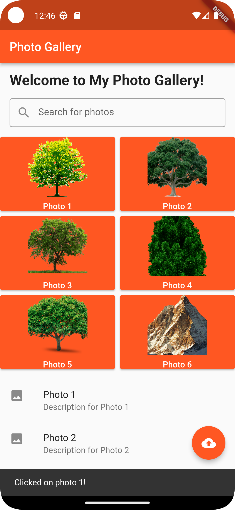
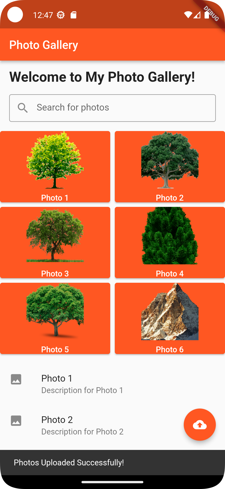

# Project Name

A brief description of your project.

## Screenshots



Photo Description with SnackBar Message 



Caption for Screenshot 2.

## Features

- Feature 1
- Feature 2
- Feature 3

## Installation

1. Clone the repository.
2. Run `flutter pub get` to install dependencies.
3. Run the app using `flutter run`.

## Usage

Explain how to use your project or provide code examples.

```dart
// Code example goes here
