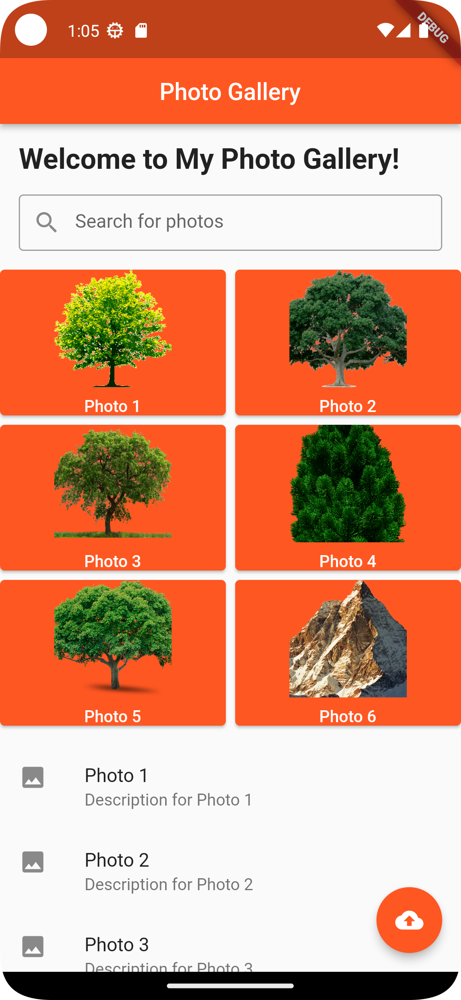
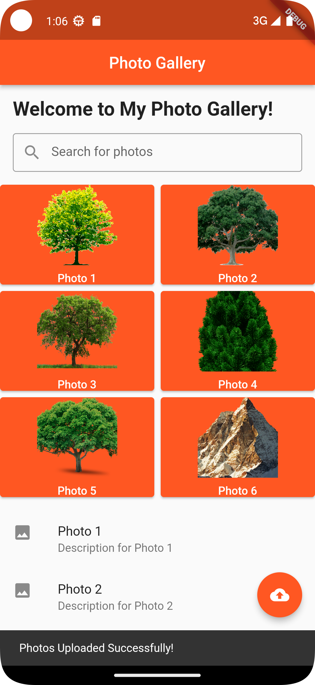

# Photo Gallery

## Screenshots

 

Main LayOut

 

Photo Description with SnackBar Message

 

Upload Button with Snackbar

## Installation

1. Clone the repository.
2. Run `flutter pub get` to install dependencies.
3. Run the app using `flutter run`.

